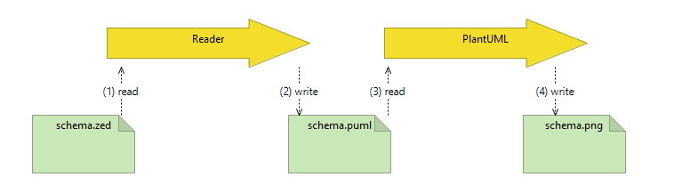
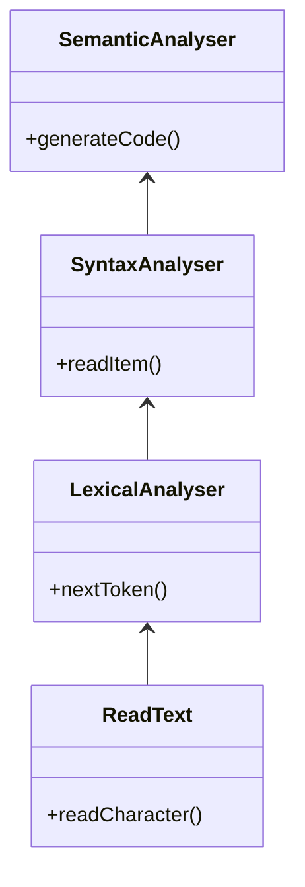
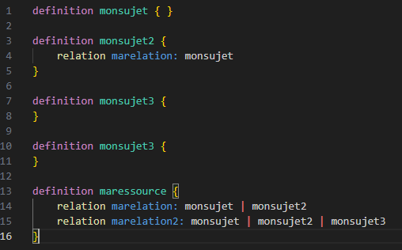
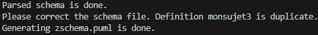
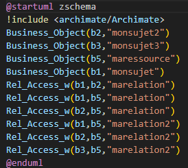
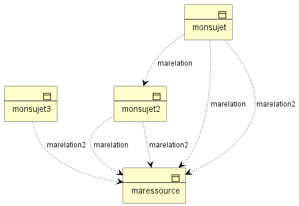
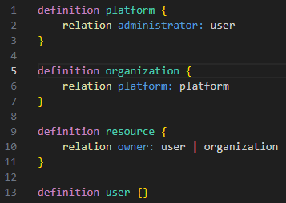
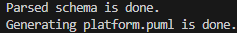
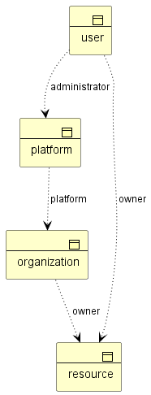
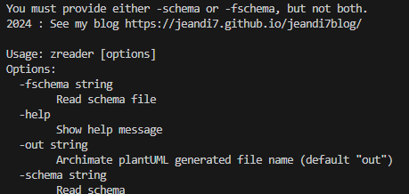

# Zanzibar SpiceDB-like Reader +  Archimate PlantUML Generation Code  in less than 450 lines of golang : part II

part One is here : https://github.com/jeandi7/zreader1

We find ourselves 100 lines later (350 + 100) with part II

Unlike Part One, the Reader adds now a generation of a plantUML code file.

Honestly compared to part 1, this is the easiest part.

The most complex part is writing the BNF grammar.

The goal is to visualize a business object diagram  (with Archimate standard) with the well-know plantUML tool:




```
// Zanzibar restricted BNF grammar
// SpiceDB like
// Only relations are declared (not permissions)
// Compared to Part 1, I have to think about code generation in this grammar
// a generation code for definitions
// a generation code for relationships

<Zschema> ::= <Zdef>*
<Zdef> ::= "definition" <Zname> "{" <Zbody> "}"  ---> generation
<Zname> ::= <identifier>
<Zbody> ::= <Zrelation>*
<Zrelation> ::= "relation" <Zname> ":" <Zname> ("|" <ZName)*   ---> generation 
<Zname> ::= <identifier>
<identifier> ::= [a-zA-Z_][a-zA-Z0-9_]*

```

# Zanzibar Reader + Generation code

Implementation is made with lexical analysis, syntaxic analysis as in part I and a semantic analysis in addition for this part 2 



# Example 1

With zschema.zed like this :



I voluntarily copy/paste the definition mysubject3 inside the zed file.

<span style="color:yellow">tape :</span> go run zreader.go -fschema "./zschema.zed" -out "zschema"

<span style="color:yellow">response: </span>



The new semantics module detected the double occurrence of mysubject3. All right.

the zschema.puml is the generated file :



Plantuml allows you to generate the following PNG file with the zschema.puml as input:



# Example 2

The platform.zed is :



<span style="color:yellow">tape :</span> go run  zreader.go -fschema "./platform.zed" -out "platform"

<span style="color:yellow">response:</span>



Using the generated platform.puml file with PlantUML helps us to show the Archimate following diagram :



# Help mode

<span style="color:yellow">tape :</span> go run zreader.go -help

<span style="color:yellow">response:</span>




#

About Zanzibar : https://storage.googleapis.com/pub-tools-public-publication-data/pdf/0749e1e54ded70f54e1f646cd440a5a523c69164.pdf

About SpiceDB : https://authzed.com/blog/spicedb-is-open-source-zanzibar#everybody-is-doing-zanzibar-how-is-spicedb-different

About PlantUML : https://plantuml.com/fr/download
